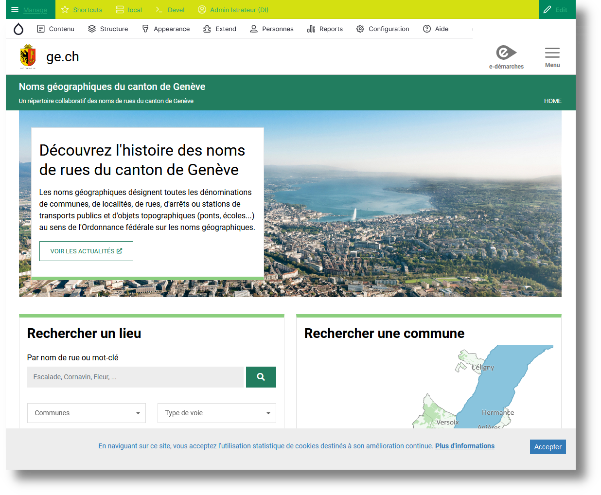
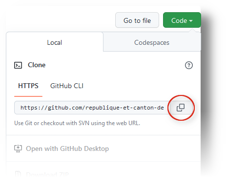

># NGEO
>Un répertoire collaboratif des noms de rues du canton de Genève



## Prérequis
Docker ou docker desktop.

## Installation
Installation basée sur la ligne de commande PowerShell, à l'exception des commandes git faites via gitbash.

### Récupérer le projet GIT.
Cloner le repo :

Copier l'url dans Github.



Cloner le projet chez vous.
```
$ git clone https://github.com/republique-et-canton-de-geneve/noms-geographiques.git
```
### Préparer l'environnement local
Modifier le fichier hosts de la machine hôte (C:\Windows\System32\drivers\etc\hosts):
``
127.0.0.1	  noms-geographiques.local.ge.ch
127.0.0.1     cmsadmin-noms-geographiques.local.ge.ch
127.0.0.1	  portainer.ngeo.local.ge.ch
127.0.0.1	  pma.noms-geographiques.local.ge.ch
127.0.0.1	  webgrind.ngeo.local.ge.ch
127.0.0.1	  mailhog.noms-geographiques.local.ge.ch
127.0.0.1	  idp.ngeo.local.ge.ch
``


Lancer le projet docker
```sh
cd 10677-ngeo/docker
docker-compose -p ngeo up -d
```

Se connecter au conteneur php:
```bash
cd 10677-ngeo/docker
docker exec -it ngeo_php /bin/sh
```
### Initialisation Drupal
Aller voir le site :
En Anonyme:
   http://noms-geographiques.local.ge.ch:8099/
Mode Connecté :
   http://cmsadmin-noms-geographiques.local.ge.ch:8099/
=> les comptes SAML locaux sont décrits dans le fichier `{project_root}/docker/comptes_locaux_saml.php`

## Composer
Exécuter les commandes composer souhaitées. Ex :
```bash
# pour lancer l'installation des 'vendor' qui ne seraient pas présents :
$ composer install

# pour ajouter un module drupal contrib ou autre composant (--dev si c'est un composant utile au développement, ex devel)
$ composer require drupal/mon-module

# avoir un statut sur les composants drupal
$ composer outdated 'drupal/*'

# faire une mise à jour => cf les bonnes pratiques de mise à jour (todo wiki ?)
$ composer update drupal/mon-module-a-mettre-a-jour
```

# Développement NGEO - Bon à savoir

## Titres de page
Pour ne pas utiliser le bloc de titre proposé de base dans les différentes pages:
1. Aller sur : Structure > Mise en page des blocs.
2. Bloc "Titre de page": configurer.
3. Dépend du type de page, mais paramétrer ici pour le désactiver. Ex: /search => aller sur Page.
4. Sauvegarder.


# Vérification de code

## PHPCS
PHP CodeSniffer sert à vérifier si les standards de code Drupal sont respectés.

1. Ajout de Coder via composer :
    ```
    composer update --prefer-source drupal/coder
    ```
2. Ajouter les dossiers pour les standards de code drupal :
    ```
    phpcs --config-set installed_paths /var/www/html/vendor/drupal/coder/coder_sniffer,/var/www/html/vendor/sirbrillig/phpcs-variable-analysis,/var/www/html/vendor/slevomat/coding-standard
    ```
3. Tester si tout est bien configuré :
    ```
    php vendor/bin/phpcs -i
    ```
4. Tester le code (ici: dans le module 'ngeo_core'):
    ```
    php vendor/bin/phpcs --standard=Drupal,DrupalPractice htdocs/modules/custom/ngeo_core
    ```
5. Fixe le code automatiquement avec phpcbf (ici: dans le module 'ngeo_core'):
   ```
   php vendor/bin/phpcbf --standard=Drupal,DrupalPractice --extensions=php,module,inc,install,test,profile,theme,css,info,txt,md htdocs/modules/custom/ngeo_core

